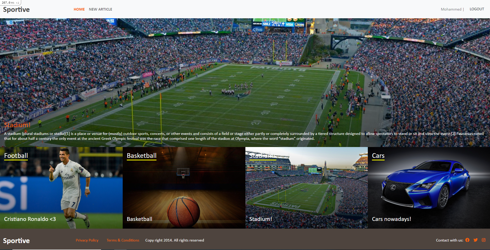

# Sportive - Capstone project

View articles, categories, create articles and vote them up!

### Screenshot

### Tests

## Presentation
- [Presentation video](https://www.loom.com/share/1bc51aabb4934e97ab2a1290abb45542)

## Live demo
- [Live demo](https://sportive-dev.herokuapp.com/)

## About

This project is a simple article creation web.

It focuses on using Rails ActiveRecord, Validations, Associations, MVC, RSpec testing, Frontend design and using Ruby logic making new ideas.

In this project I:

- Made a model for users, articles, votes and categories.
- Made Simplified login -using only name-.
- Made Home page viewing latest articles, randomly chosen articles and the most popular article on the site.
- Made article-creating page.
- Made article show page.
- Made testing for models.
- Made validations for all user inputs.

## Usage

- run "git clone https://github.com/Mohamed-js/sportive.git"
- run "bundle install"
- run "rails db:migrate"
- run "rails db:seed"
- run "rails s"
- Start your localhost on 3000 port in your browser: "http://127.0.0.1:3000"
- Register with name, create articles and vote for articles!

## Technologies

- Ruby
- Rails
- RSpec 
- PostgreSQL
- VSCode
- Bootstrap

## Author

👤 **Mohamed Atef**

- GitHub: [@mohamed-js](https://github.com/Mohamed-js)
- Twitter: [@demovejetta](https://twitter.com/demovejetta)
- LinkedIn: [LinkedIn](https://www.linkedin.com/in/mohamed-js/)

## 🤝 Contributing

Contributions, issues, and feature requests are welcome!

## Show your support

Give a ⭐️ if you like this project!

### Acknowledgements

- Microverse
- The Odin Project
- Notion
- Behance: Nelson Sakwa

## 📝 License

This project is [MIT](./LICENSE) licensed.